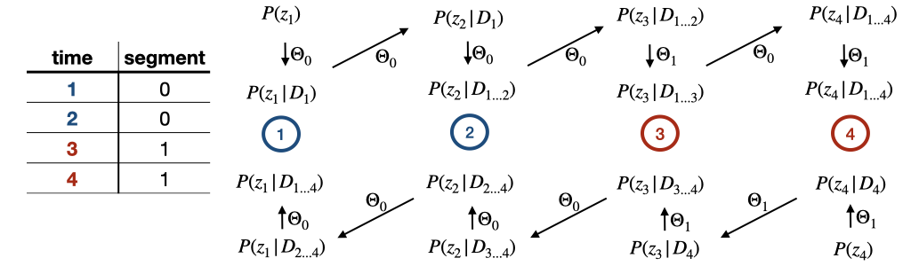

# gfp_gaussian_process

---
## Table of Content
- [gfp_gaussian_process](#gfp_gaussian_process)
  - [Table of Content](#table-of-content)
  - [1 Compile](#1-compile)
    - [1.1 Compile locally](#11-compile-locally)
    - [1.2 Compile on cluster](#12-compile-on-cluster)
  - [2 Run](#2-run)
    - [2.1 Required arguments](#21-required-arguments)
      - [2.1.1 Input file](#211-input-file)
      - [2.1.2 Parameter file](#212-parameter-file)
    - [2.2 Using segments](#22-using-segments)
    - [2.2.3 Optional arguments](#223-optional-arguments)
      - [2.3.1 Csv_config file](#231-csv_config-file)
  - [3 Model parameters](#3-model-parameters)
  - [4 Output](#4-output)
    - [4.1 maximize](#41-maximize)
    - [4.2 scan](#42-scan)
    - [4.3 predict](#43-predict)
    - [4.4 auto_correlation](#44-auto_correlation)
  - [5 Error messages](#5-error-messages)
  - [TODO](#todo)

---

## 1 Compile
### 1.1 Compile locally
The following two libraries are needed:
- nlopt (for minimization)
  - see [nlopt documentation](https://nlopt.readthedocs.io/en/latest/#download-and-installation) for installation details
- Eigen (for linear algebra)
  - see [Eigen documentation](http://eigen.tuxfamily.org/index.php?title=Main_Page) for installation details
  
Make sure the correct paths to the two libraries are set in the `Makefile`. Currently both are assumed to be located in the home directory. Then, compile with:

`cd src; make local`

### 1.2 Compile on cluster
1. Install nlopt
- Will install nlopt in home-directory with static linking. You can change that via `DCMAKE_INSTALL_PREFIX`, but make sure to adjust the makefile accordingly!
```
ml CMake
wget https://github.com/stevengj/nlopt/archive/v2.6.2.tar.gz
tar -xf v2.6.2.tar.gz 
cd nlopt-2.6.2/
cmake -DCMAKE_INSTALL_PREFIX=~/nlopt -DBUILD_SHARED_LIBS=OFF .
make
make install
```
2. Compile 
- Clone this repository and navigate to the `src` directory within the repository
- Run `make cluster`. This will run `ml GCC/8.3.0; ml Eigen/3.3.7` as well as the compile command! Note, that the modules remain loaded after compilation.


## 2 Run
`cd bin`
`./gfp_gaussian [-options]` with following options:
```
-h, --help                 this help message
-i, --infile               (required) input data file
-b, --parameter_bounds     (required) file(s) setting the type, step, bounds of the parameters
-c, --csv_config           file that sets the colums that will be used from the input file
-l, --print_level          print level >=0, default: 0
-o, --outdir               specify output direction and do not use default
-t, --tolerance            absolute tolerance of maximization between optimization steps, default: 1e-1
-space, --search_space     search parameter space in {'log'|'linear'} space, default: 'linear'
-stat, --stationary        indicates that the cells are not growing much
-beta, --use_beta          indicates that the initial beta will be used to initialize the cells
-m, --maximize             run maximization
-s, --scan                 run 1d parameter scan
-p, --predict              run prediction
-a, --auto_correlation     run auto_correlation
```
Example: `./gfp_gaussian -c csv_config.txt -b parameter_min.txt -i ../data/simulation_gaussian_gfp.csv -o out/ -l 1 -t 1e-2  -m -p`

### 2.1 Required arguments
- `infile` sets the input file that contains the data, eg as given by MOMA (see 2.1.1)
- `parameter_bounds` sets the file that defines the parameter space (see 2.1.2)

#### 2.1.1 Input file
The input file is assumed to fullfil the following:
- the data points of a cell appear as consecutive rows and are in the correct order with repect to time
- the data set has to include all columns that are set via the `csv_config` file, i.e. time_col, length_col, fp_col
- the cells can be uniquely identified via the tags provided via `parent_tags` and `cell_tags` and each mother cell has at most 2 daughter cells. If that is not the case, the `parent_tags` and `cell_tags` are not sufficient and a warning will be printed.
- In order to estimate the initial covariance matrix, the data set needs to contain at least (!) 2 cells.
- An optional column are the usage of segments, see below for more information


#### 2.1.2 Parameter file
Syntax for free, bound, fixed (in that order) parameters
- parameter = init, step
- parameter = init, step, lower, upper
- parameter = init
  
Example:
```
mean_lambda = 0.01, 1e-3
gamma_lambda = 0.01, 1e-3, 1e-4, 0.05
var_lambda = 1e-07
```
ALL parameters are restricted to positive numbers by default avoiding unphysical/meaningless parameter ranges. By setting the lower bound in the parameter file, one can overwrite the lower bounds of the parameters. 

The step value is used for the 1d scan to discretize the interval set by lower and upper. During the maximization this will be the initial step size. From nlopt doc: 
"For derivative-free local-optimization algorithms, the optimizer must somehow decide on some initial step size to perturb x by when it begins the optimization. This step size should be big enough that the value of the objective changes significantly, but not too big if you want to find the local optimum nearest to x."

### 2.2 Using segments
To analyse data sets that contain data points that shall be fitted by a different set of underlying parameters segment indices can be used. For that, a `segment_col` in the `csv_config` file can be specified. This column should contain the _segemnt index_ specifying for each data point to which segment it belongs. The segment indices are require to be consecutive and start at index 0. 

The likelihood maximization that determines the parameter estimates are run independently for each segment. That means there is no difference between running different segments in sperate runs or as part of the same data set. The same behavior is used for 1d scans. However, the predictions as well as the calculation of the joint probablities that are used for the correlation functions are calculated by iterating through the entire data set. For that, the following scheme is used

Where each step involves two calculations: the calculation of the new prior which depends on the parameters of the biophysical model and the calculation of the posterior which depends on the parameters of the measurement noise. Note, that the prior calculation to go from time point 2 to 3 and vice verse both take the parameters of the 0th segment.

For each segment in the data set one parameter file is required submitted in the order of the segment indices. For example:
```
./gfp_gaussian -b parametersA.txt parametersB.txt ... 
```
will use the parameters in the file `parametersA.txt` for the segment with index 0 and the parameters in the file `parametersB.txt` for the segment with index 1, etc...

### 2.2.3 Optional arguments
- `csv_config` sets the file that contains information on which columns will be used from the input file (see 2.3.1)
- `print_level=0` supresses input of the likelihood calculation, `1` prints every step of the maximization/scan/error bar calculation. This is purely meant for debugging!
- `tolerance` sets the stopping critirium by setting the tolerance of maximization: Stop when an optimization step changes the function value by less than tolerance. By setting very low tolerances one might encounder rounding issues, in that case the last valid step is taken and a warning is printed to stderr.
- `outdir` overwrites default output directory, which is (given the infile `dir/example.csv/`) `dir/example_out/`
- `search_space` set the search space of the parameters to be either in log space of linear space. The parameter file does not need to be changed as everything is done internally. 
- `stationary` indicates that the cells growth is close to 0. Thus, the initial gfp production is calculated in this limit
- `use_beta` indicates that the bleaching rate beta given in the parameter file as the initial value shall be used to calculate the initial gfp production estimate. This, can be used with or without `--stationary`.

#### 2.3.1 Csv_config file
The following settings define how the input file will be read. Default values in brackets.
- time_col (time_sec): column from which the time is read
- rescale_time (60): factor by which time will be devided before the anything is run. This can be used to use a different time unit for the input than for the model paramters.
- length_col (length_um): column from which the length of the cell is read
- length_islog (false): indicates if the cell length in the data file is in logscale (true) of not (false)
- fp_col (gfp_nb): column from which the intensity is read
- delm (,): delimiter between columns, probably ',' or ';'
- segment_col (): column from which the segment index is read. Not setting `segment_col` in the file indicats that segment indices will not be used 
- filter_col (): column from which the filter will be read. To INclude a data point, set the entry in this column to `True`, `true`, `TRUE` or `1` and to EXclude a data point, set the entry in this column to `False`, `false`, `FALSE` or `0`. Not setting `filter_col` in the file indicats that the input file will not be filtered
- cell_tag (date, pos, gl, id): columns that will make up the unique cell id, endings like .0 .00 etc of numeric values will be removed
- parent_tags (date, pos, gl, parent_id): columns that will make up the unique cell id of the parent cell, endings like .0 .00 etc of numeric values will be removed


## 3 Model parameters
The 2 OU processes are descibed with a mean value (thus the mean growth/production rate), a gamma parameter determining how fast the process is driven towards its mean after a deviation, and a variance that scales the noise term. Thus we have the following parameters including the bleaching rate of the fp, beta:
- Growth rate fluctualtions params:
    - mean_lambda
    - gamma_lambda  
    - var_lambda     
- gfp fluctuation params:
    - mean_q    
    - gamma_q    
    - var_q  
    - beta         

Additionally, asymmentric cell division is modeled via two variances of gaussians
- cell division:
    - var_dx 
    - var_dg     


Finally, the length of the cell and the gfp is effected by measurement noise
- Measurement noise:
    - var_x     
    - var_g  

## 4 Output
The following run modes can be set:
-m, --maximize 
-s, --scan 
-p, --predict
-a, --auto_covariance
The respective output is explained below.

All files that are generated in the maximization and the prediction step are named as follows: `example_f<free>_b<bounds>` and where `<free>` lists the variable via the index as e.g. printed when the code is run and `<bounds>` lists the bound parameters in the same way. Example: `example_f034_b129`. Then, the ending of the diffenerent files inicate what they contain. 

Each file generated starts with a table with the parameter settings that were used to enable reproducability:
- The first line is a header for the parameter table 
 and the following 11 lines contain the parameter setting and potentially the final estimates from the optimisation if available. The prediction files and the auto_correlation file append the parameter settings of the other segments one after another if multiple segments are present.
- The following line is empty

### 4.1 maximize
- Will create 3 files: one for the maximization process (`_interations.csv`), one for the final estimations (`_final.csv`), and a "parameter file" (`_parameter_file.csv`) that can directly be used as an input for a prediction run (this file is formated like the input parameter file and does not contain the table contain the parameter settings)
- The _interations_ file contains all likelihood evaluations of the likelihood maximization
- The _final_ file contains the estimated error for the estimated paramters via a hessian matrix. The hessian is calculted using a range of finit-differnences that are set relative to the value of the respective paramter. I.e. epsilon=1e-2 corresponds to 1% of each paramterer is used for the hessian matrix estimation. Finally, the number of data points, the total log likelihood, the normalized log likelihood, the used optimization algorithm, the set tolerance and the search space (log/linear) is noted.
- The _parameter_ file is in the format of the parameter file that was submitted to the code (see Sec. 2.1.2). It only contains the final estimation of each parameter. Thus, the paramters are treated as "fixed", when the code is run with this parameter file. This file can be used to run the prediction step directly (potentially on a different input file).

As the maximization is run on the different segments independently, `_segment` followed by the segment index is added to the sample input file name in case there are multiple segments. 


### 4.2 scan
- The 1d parameters scans will calculate the likelihood for the 1d ranges set by the parameter_bound file. Note, only "bound" parameters will be scaned
- Will create a file for each parameter containing all calculated likelihoods of the scan

 `_segment` followed by the segment index is added to the sample input file name in case there are multiple segments. 

### 4.3 predict
- In case the maximisation is also run, the final parameter estimate is used for the prediction, otherwise the init value of each parameter is used.
- Will create 3 files: combined predictions (`_prediction.csv`), backward only (`_prediction_backward.csv`), and forward only (`_prediction_forward.csv`)
- The predictions consist of:
  - the 4 mean quanties of `x`, `g`, `l` (referes to lambda), and `q` 
  - the upper triangle of the covariance matrix labeled `cov_zi_zj` where `zi` and `zj` are one of `x`, `g`, `l`, and `q`.
  - ... of each time point for each cell in the same order as the input file

### 4.4 auto_correlation
- The auto-correlation function _R(dt)_ is calculated over values of _dt_ that are equidistant. The incremenent is determined as the 30th pecentile of all the time increments between measurements in the data set. Measuremnt pairs with time differences that do not match any of the _dt_ are ignored (and a warning is printed). 
- Running the auto-correlation part also runs the prediction part and generates those files, too. Setting both flags is therefore redundant but also not harmful.
- A correlation file(`_correlation.csv`) is created:
  - The file contains the upper-triangle of the correlation matrix for each `dt`. The largest `dt` corresponds to the largest distance of time points within any cell cycle in the data set, i.e. the time of the longest cell cycle. The correlation entries are labeled `R(zi(...),zj(...))` where `zi` and `zj` are one of `x`, `g`, `l`, and `q`.
  - The file also includes the number of joint probablilties `joint_number` the calculation of each correlation matrix is based on. Thus, the very last correlation matrix might only be based on a single joint, in case the maximal cell cylce time is unique in the data set. Of course, the last correlation matrices are much less reliable.

## 5 Error messages
The code has a number of errors that might be thrown at runtime. Some of them are listed below. In particular, the error that occur during command line parsing (arg_parser) are not listed here. 
- _(sc_likelihood) ERROR: Log likelihood calculation failed: Log likelihood is Nan_: The likelihood of the data is maximised starting from the initial set of parameters. However, for initial parameters far away from the optimum the evaluation of the likelihood becomes numerically inaccessible. Thus, if Nan occur in during the maximisation of the likelihood, the code is stopped and it is necessary to **set new (and ideally more accurate) initial parameters**. The issue might also occur, if the initial guess is fine, but the first step (given by the _step_ in the parameter file) kicks the calculation out of the range in which the likelihood can be evaluated. In this case, the Nans occure in the later entries in the iteration file and one needs to set new initial steps. Note, that also the sign of the step matters. 
- _(minimize_wrapper) ERROR: Log likelihood optimization failed_: Something went wrong during the optimisation of the likelihood. Just **let me know**.
- _(build_cell_genealogy) ERROR: Both daughter pointers are set_: Each parent cell is expected to have 0, 1 or 2 daughter cells, in case there are more daughter cells associated with a parent cell, the code is stopped. The setting of *parent_tags* and *cell_tags* in the csv_config file might not be set correctly, meaning the combination of the tags is still ambiguous pointing to different cells. **Revise the *parent_tags* and *cell_tags*.**
- _(get_data) ERROR: (...) is not an column in input file_: The keyword marking the column that is used for getting the time/log_length or fp from the input file is not found in the header. **Make sure the keyword matches the name of the column in the input file.**
- _(get_data) ERROR: Line ... cannnot be processed_: A line in the input file contains an **entry (in time/log_length or fp) that is not a number**. Note, that Nans are also rejected.
- _(set_paramter) ERROR: Parameter settings of ... cannot be processed_: The processing of the parameter file failed. The formating of the parameter file is explained above. In particular, **all arguments of the parameter setting need to be numbers**.  Note, that Nans are also rejected.
- _(check_if_complete) ERROR: Parameter ... not found in parameter file_: **Each parameter needs to be set in the parameter file.**. The code is stopped if one (or more) is missing.


---------
Likelihood calculation on single cell level is reimplementaion of the [python code](https://github.com/fioriathos/new_protein_project).

## TODO
- [x] prepare for cluster
- [x] write new simulation including asymmetric cell division and tree structure?
- [x] use log of parameters
- [x] add stationary option
- [x] include beta in initializing cells
- [x] create a parameter file that can be used as input 
- [x] include error messages to the readme
- [x] consistent output files 
- [x] check input and give precise error messages
- [x] catch all Nans in optimisation
- [x] autocorrelation
- [ ] segments