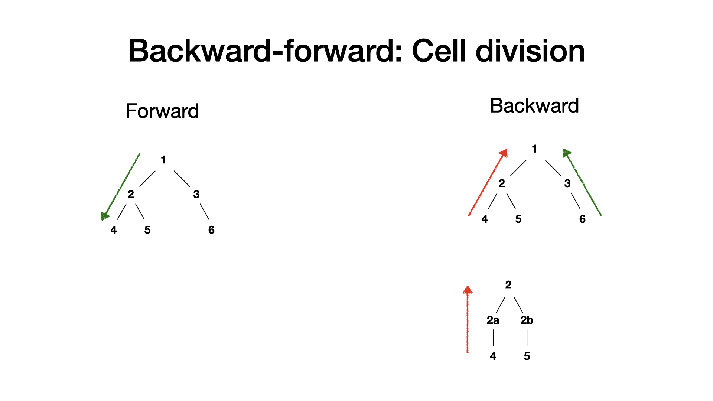

# gfp_gaussian_process
Likelihood calculation and predictions of 1 dimensional genealogy is re-implementaion of the python code: https://github.com/fioriathos/new_protein_project.

---
## Usage 

### Compile
The following libraries are needed:
- nlopt (for minimization)
  - can be installed via cmake
  - can be statically compiled easily
  - see also https://nlopt.readthedocs.io/en/latest/#download-and-installation
- Eigen (for linear algebra)
  - available via modules
  - see also http://eigen.tuxfamily.org/index.php?title=Main_Page
  
Make sure the correct paths to the two libraries are set in the `Makefile`. Currently both are assumed to be located in the home directory. Then, compile with:

`cd src; make`

### Run
`cd bin`
`./gfp_gaussian <infile> [-options]` with following options:

```
-h, --help                 help message
-i, --infile               (required) input/data file
-b, --parameter_bounds     (required) file defining the type, step, bounds of the parameters
-c, --csv_config           file that sets the colums that will be used from the input file
-l, --print_level          print level >=0, default=0
-o, --outdir               specify output direction and do not use default
-r, --rel_tol              relative tolerance of minimization, default=1e-2
-m, --minimize             run minimization
-s, --scan                 run 1d parameter scan
-p, --predict              run prediction
```
##### Required arguments
- `infile` sets the input file that contains the data, eg as given by MOMA
- `parameter_bounds` sets the file that defines the parameter space


##### Optional arguments
- `csv_config` sets the file that contains information on which columns will be used from the input file
- `print_level=0` supresses input of the likelihood calculation, `1` prints every step of the minimization/scan
- `rel_tol` sets relative tolerance of minimization
- `outdir` overwrites default output directory, which is (given the infile `dir/example.csv/`) `dir/example_out/`

##### Run modes
- `m (minimize), s(scan), p(predict` will run the respective task. In case `minimize` and `predict`is set, the estimated paramters after the minimization will be used for the prediction. Those paramters that are fixed are of course not effected.
- the 1d parameters scans will calculate the likelihood for the 1d ranges set by the parameter_bound file. Note, only "bound" parameters will be scaned


### Parameter file
Syntax for free, bound, fixed (in that order) parameters
- parameter = init, step
- parameter = init, step, lower, upper
- parameter = init
  
Example:
```
mean_lambda = 0.01, 1e-4
gamma_lambda = 0.01, 1e-4, 1e-4, 0.05
var_lambda = 1e-07
```
The step value is used for the 1d scan to discretize the interval set by lower and upper. During the minimization this will be the initial step size.

### Model parameters
The OU processes are descibed with a mean value (thus the mean growth/production rate), a gamma parameter determining how fast the process is driven towards its mean after a deviation, and a variance that scales the noise term. Thus we have the following parameters:
- Growth rate fluctualtions params:
    - mean_lambda
    - gamma_lambda  
    - var_lambda     
- gfp fluctuation params
    - mean_q    
    - gamma_q    
    - var_q  
    - beta      

Additionally, the lenth of the cell and the gfp is effected by measurement noise
- Measurement noise
    - var_x     
    - var_g     

Finally, asymmentric cell division is modelled via
- cell division:
    - var_dx 
    - var_dg      


### Output
##### Minimization
- Will create a file containing the parameter settings at the top 12 lines and all steps of the likelihood minimization
- The file (given the input file `example.csv`) is named as follows: `example_f<fixed>_b<bounds>.csv`, where `<fixed>` lists the variable via the index as eg printed when the code is run and `<bounds>` lists the bound parameters in the same way. Example: `example_f034_b129.csv`
- 
##### 1D scan
- Will create a file for each parameter containing the parameter settings at the top 12 lines and all calculated likelihoods of the scan
- The file (given the input file `example.csv`) is named as follows: `example_<parameter>.csv`, where `<parameter>` is the paramter that is scaned

##### Predictions
- Will create a file for each parameter containing the parameter settings at the top 12 lines and ...
  - the 4 mean quanties of x, g, l/lambda, q 
  - the upper triangle of the covariance matrix 
  - of each time point for each cell in the same order as the input file

---
## Notes 
  
### TODO: 
- [ ] compare forward/backward prediction with python version
- [ ] check signs in backwards direction
- [ ] new simulation including asymmetric cell division?

## Technical Notes
### Cell division in backwards direction


### Likelihhod and prediction calculation along cell tree
- function for likelihood and predictions for the single cells are applies recursively to go up/down the tree
- every cell is accessed once 
- every cell is accessed after its parent(down direction)/daughter cells(up direction)

```cpp
    /* applies the function func to the cell cell and the other cells in the genealogy
    * such that the parent cell has already been accessed when the function is applied 
    * to the cell.
    * 
    * Example (number implies the order in which)
    * _________________________________________________ 

	       1            |
	     /   \          |
	    2     5         |
	  /   \     \       |
	 3     4     6      V

    * _________________________________________________ 
    */
void prediction_forward(const std::vector<double> &params_vec, std::vector<MOMAdata> &cells){
    std::vector<MOMAdata *> p_roots = get_roots(cells);

    for(int i=0; i<p_roots.size(); ++i){
        prediction_forward_recr(params_vec,  p_roots[i]);
    }
}

    /* applies the function func to the cell and the other cells in the genealogy
    * such that the daughter cells has already been accessed when the function is applied 
    * to the cell.
    * 
    * Example (number implies the order in which cell is accessed)
    * _________________________________________________ 

	       6            ^
	     /   \          |
	    3     5         |
	  /   \     \       |
	 1     2     4      |

    * _________________________________________________ 
    */
void prediction_backward(const std::vector<double> &params_vec, std::vector<MOMAdata> &cells){
    std::vector<MOMAdata *> p_roots = get_roots(cells);

    for(int i=0; i<p_roots.size(); ++i){
        prediction_backward_recr(params_vec,  p_roots[i]);
    }
}
```


## Minimizer 
 - nlopt 

```cpp
void minimize_wrapper(double (*target_func)(const std::vector<double> &x, std::vector<double> &grad, void *p),
                        std::vector<MOMAdata> &cells,
                        Parameter_set &params, 
                        double relative_tol)
```
### Current minimizer: COBYLA
-  Constrained Optimization By Linear Approximation (COBYLA)
-  Implementation of Powell's method:
   -  pick initial x0 and two directions h1, h2
   -  starting from x0 1D optimization along first direction h1 -> find x1
   -  starting from x1 1D optimization along first direction h2 -> find x2
   -  h3 connects x0 and x2
   -  starting from x2 1D optimization along first direction h3 -> find x3
